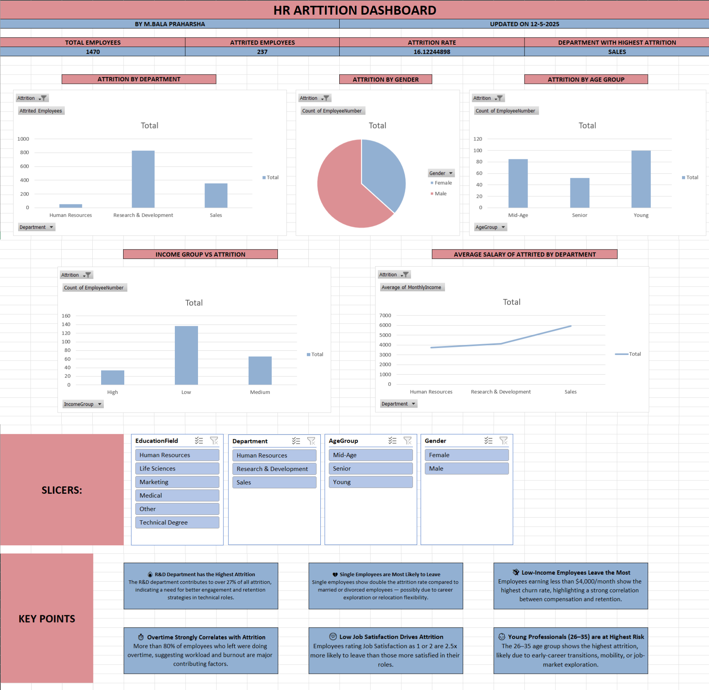
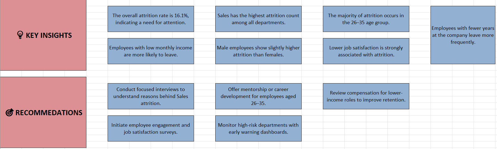

# 📊 HR Attrition Dashboard

An Excel-based dashboard analyzing employee attrition trends across departments, age groups, gender, income, and job satisfaction.

---

## 🖼️ Dashboard Preview

### 🔻 Full Dashboard  

---

### 📌 Key Insights & Recommendations  

---

## 🚀 Overview

This project analyzes HR data using Excel dashboards with slicers and charts to understand employee attrition and provide action-focused insights.

---

## 🧠 Key Takeaways
- 🔬 **R&D Department has the Highest Attrition**
- 💼 **Single Employees are Most Likely to Leave**
- 💰 **Low-Income Employees Leave the Most**
- ⏱️ **Overtime Strongly Correlates with Attrition**
- 😞 **Low Job Satisfaction Drives Attrition**
- 👶 **Young Professionals (26–35) are at Highest Risk**

---

## ✅ Recommendations
- Improve work-life balance and job satisfaction
- Increase pay equity, especially in low-income roles
- Focus retention efforts on younger professionals
- Monitor attrition trends regularly with dashboards

---

## 📁 Repository Contents
- `HR_ATTRITION_DASHBOARD.xlsx` – Excel dashboard
- `FULL-DASHBOARD.png` – Full visual dashboard
- `Insights_Recommendations.png` – Summary of insights
- `README.md` – This documentation

---

## 🛠️ Tools Used
- Microsoft Excel
- Pivot Tables
- Slicers & Filters
- Bar, Pie & Line Charts

---

## 👨‍💻 Author
**M. Bala Praharsha**  
🗓️ Updated on: 12-May-2025

---

⭐ **If you found this useful, give this project a star!**
